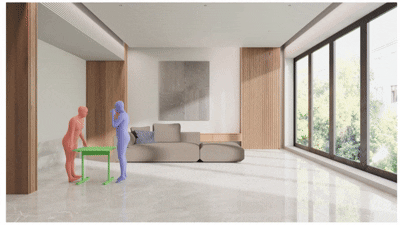
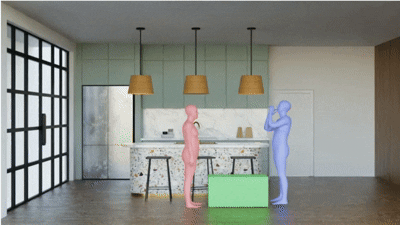
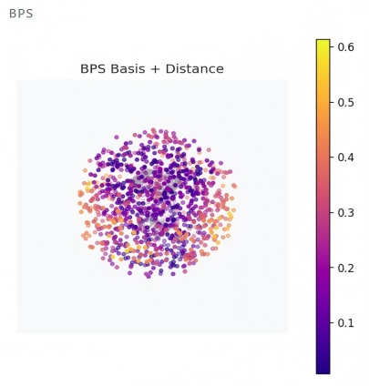
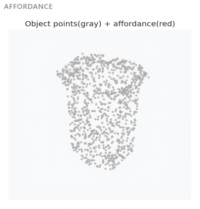
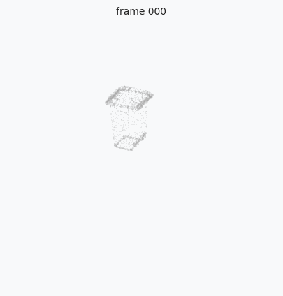

# [CVPR 2026] StaCOM: Stability-Driven Motion Generation for Object-Guided Human-Human Co-Manipulation

Official codebase for CVPR 2026 paper **"Stability-Driven Motion Generation for Object-Guided Human-Human Co-Manipulation"**.

**[Jiahao Xu](https://openreview.net/profile?id=~Jiahao_Xu9)**, **[Xiaohan Yuan](https://yuan-xiaohan.github.io/)**, **[Xingchen Wu](https://openreview.net/profile?id=~Xingchen_Wu1)**, **[Chongyang Xu](https://github.com/Wil909)**, **[Kun Li](https://cic.tju.edu.cn/faculty/likun/)**, **[Buzhen Huang](https://www.buzhenhuang.com/)**  
Tianjin University, National University of Singapore, Sichuan University

[Project](http://www.buzhenhuang.com/works/StaCOM.html) · [Paper](http://www.buzhenhuang.com/publications/papers/Xu_CVPR2026.pdf)


<p align="center">
  
  
</p>
---

## Installation

The code is tested on Ubuntu with a single RTX 4090 GPU (24GB).

Create the conda environment:

```bash
conda create -n stacom python=3.10
conda activate stacom
```

Install PyTorch with CUDA 11.8:

```bash
pip install torch==2.1.2+cu118 torchvision==0.16.2+cu118 torchaudio==2.1.2+cu118 --index-url https://download.pytorch.org/whl/cu118
```

Install other dependencies:

```bash
pip install -r requirements.txt
```

Download the official **SMPL-X** model from the [SMPL-X website](https://smpl-x.is.tue.mpg.de/) and place it in ```data/smplx/```.


## Demo

### Input format

Three files are required:

- `object.obj` — object mesh in its local coordinate frame
- `trajectory.npy` — object 6D pose sequence, shape `(T, 4, 4)`
- `affordance.npz` — per-point affordance scores, must contain key `sampled_scores` of shape `(N,)`

### Run

Run the motion generation demo with a trained checkpoint:

```bash
python demo.py \
    --obj-mesh     data/test/01/box001.obj \
    --obj-traj     data/test/01/trajectory.npy \
    --affordance   data/test/01/affordance.npz \
    --contact-ckpt output/contact_epoch200.pkl \
    --motion-ckpt  output/hoi_epoch200.pkl \
    --body-model   data/smplx/SMPLX_NEUTRAL.pkl \
    --output-dir   output/
```

The output video is saved to `output/res_20260325_143022.mp4`.

**Optional arguments:**

| Argument | Default | Description |
|---|---|---|
| `--gpu-index` | `0` | CUDA device index |
| `--physics` | off | Enable stability-driven physics simulation (CMA-ES).|

Run the visualization demo below for contact point:

```bash
python vis_contact.py
```

The demo expects uploaded inputs such as:

- mesh (`.obj`)
- object trajectory (`trajectory.npy`)
- affordance (`affordance.npz`)
- GT contact (`gt_contact.npz`)

---


## Condition Generation

Generate necessary condition data with:

```bash
python utils/data_collection.py --config=cfg_files/config.yaml
```
<table>
  <tr>
    <td align="center"><b>BPS</b></td>
    <td align="center"><b>Affordance</b></td>
    <td align="center"><b>Object Trajectory + Contact Points</b></td>
  </tr>
  <tr>
    <td align="center"></td>
    <td align="center"></td>
    <td align="center"></td>
  </tr>
  <tr>
    <td align="center">Basis Point Set representation encoding the object geometry and distance features.</td>
    <td align="center">Predicted interaction affordance regions on the object surface.</td>
    <td align="center">Object motion trajectory together with human-object contact locations.</td>
  </tr>
</table>

## Training

[SDF loss](https://github.com/penincillin/SDF_ihmr) is required for penetration evaluation.

Download the dataset from:

```
(To be released)
```

Place the dataset under `data/` as specified by `--data_folder`, then run the following to train the motion generation model:
 
```bash
python main.py \
    --mode        train \
    --data_folder data \
    --trainset    "CORE4D_real CORE4D_syn" \
    --testset     CORE4D_S1 \
    --model       interhuman_flow_BPS_prior \
    --epoch       2000 \
    --batchsize   4 \
    --lr          0.0001 \
    --worker      6 \
    --output      output
```
<!-- 
## Testing / Evaluation Inference

For testing, only make small config changes and still run `main.py`.

### 5.1 test mode

Set:

```yaml
mode: test
```

Then run:

```bash
python main.py --config=cfg_files/config.yaml  
``` -->

<!-- --- -->

## Citation

```bibtex
@inproceedings{xu2026stability,
  title={Stability-Driven Motion Generation for Object-Guided Human-Human Co-Manipulation},
  author={Xu, Jiahao and Yuan, Xiaohan and Wu, Xingchen and Xu, Chongyang and Li, Kun and Huang, Buzhen},
  booktitle={Proceedings of the IEEE/CVF Conference on Computer Vision and Pattern Recognition (CVPR)},
  year={2026}
}
```